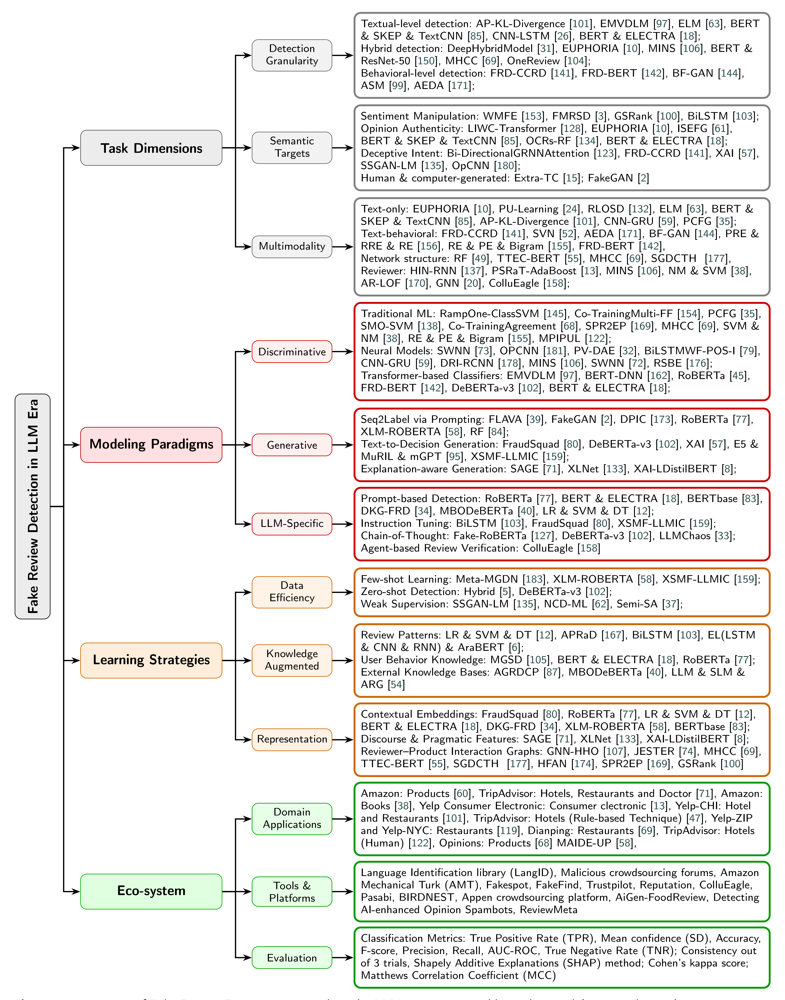

# A Survey on Fake Review Detection

## 📌 Overview

This repository accompanies our survey paper on **fake review detection**, providing a structured summary of existing research, datasets, and methodologies.

## 🧠 Key Contributions

* Comprehensive survey of fake review detection techniques.
* Evolution from traditional methods to PLM and LLM paradigms.
* Analysis of adversarial and cross-domain challenges.
* Future directions for robust and knowledge-enhanced detection.

## 📂 Repository Structure

* `papers/`: categorized paper list
* `datasets/`: dataset summary
* `figures/`: taxonomy and diagrams

## 🔍 Taxonomy



## 📚 Paper List

See [papers/README.md](papers/README.md)

## 📊 Datasets

See [datasets/dataset_list.md](datasets/dataset_list.md)

## 📖 Citation

If you find this repository useful, please cite our survey:

```bibtex
@article{yang2026survey,
  title={A Survey on Fake Review Detection: From Pre-trained Language Models to Large Language Models},
  author={Yang, Fanji and Chen, Huiyao and Yu,Xi and Zhang, Meishan and Xiao, Xiaohong and Deng, Mingsen}
}
```

## ⭐ Star this repo if it helps!
