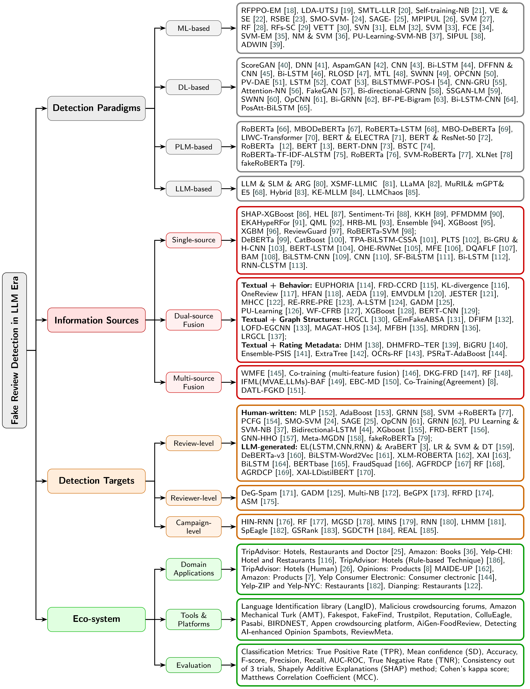

# A Survey on Fake Review Detection: From Pre-trained Language Models to Large Language Models

🔥🔥🔥 **The article has been accepted by Information Fusion**.

This repository serves as the companion resource for the paper “A Survey on Fake Review Detection: From Pre-trained Language Models to Large Language Models”. It aims to provide a structured and continuously updated collection of representative studies, publicly available datasets, and related methods in the field of fake review detection.

Our survey systematically reviews the development of fake review detection, from traditional machine learning and deep learning to pre-trained language models (PLMs) and large language models (LLMs). Particular attention is devoted to the emerging challenges posed by LLM-generated fake reviews and their detection.

If you find relevant academic papers, datasets, open-source implementations, or other valuable research resources that are not yet included in this repository, or if you have any suggestions, comments, or corrections, please feel free to contact us via email:

Email: fnajiyang@mail.gufe.edu.cn

We sincerely appreciate your feedback and contributions, which will help us continuously improve this repository and provide a more comprehensive and up-to-date resource for researchers working on fake review detection.

If you find this survey useful for your research, please consider citing our paper:
```bibtex
@article{YANG2027104715,
title = {A survey on fake review detection: From pre-trained language models to large language models},
journal = {Information Fusion},
volume = {138},
pages = {104715},
year = {2027},
issn = {1566-2535},
doi = {https://doi.org/10.1016/j.inffus.2026.104715},
url = {https://www.sciencedirect.com/science/article/pii/S1566253526005919},
author = {Fanji Yang and Huiyao Chen and Xi Yu and Meishan Zhang and Xiaohong Xiao and Mingsen Deng}
}
```

## Overview

This repository accompanies our survey paper on **fake review detection**, providing a structured summary of existing research, datasets, and methodologies.

## Key Contributions

* Survey of fake review detection organized by evidence source and fusion level.
* Analysis of text, behavior, graph, metadata, multimodal, and LLM-generated signals.
* Taxonomy linking ML, DL, PLM, and LLM methods to fusion mechanisms.
* Benchmark trend analysis with cautions about label and protocol differences.
* Research agenda for uncertainty-aware, interpretable, and robust fusion.

## Repository Structure

* `papers/`: categorized paper list
* `datasets/`: dataset summary
* `figures/`: taxonomy and diagrams

## Taxonomy



## Paper List

See [papers/paper_list.md](papers/paper_list.md)

## Datasets

See [datasets/dataset_list.md](datasets/dataset_list.md)

## Citation

If you find this repository useful, please cite our survey:


